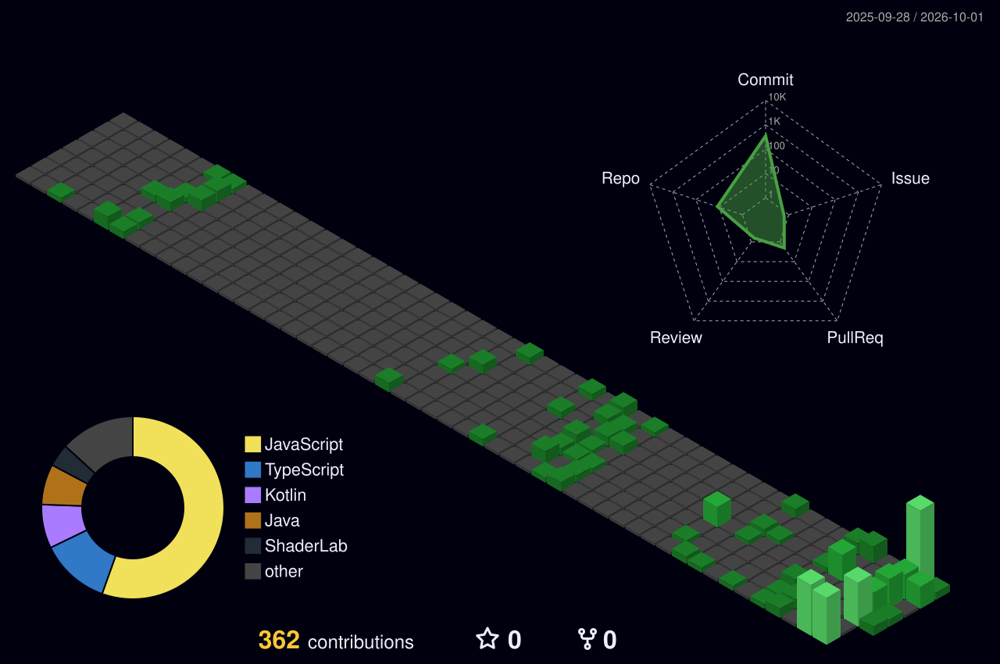

<!--
  ⚠️ ANTES DE SUBIR: busca todos los placeholders en MAYÚSCULAS y reemplázalos.
  Los principales son:
  - darman-prog
  - TU_USUARIO_LEETCODE
  - TU_WAKATIME_USER_ID
  - TU_USUARIO_MEDIUM / TU_USUARIO_DEVTO
-->

---

<table>
<tr>
<td width="32%" valign="top" align="center">

  

<kbd>📍 Bucaramanga, Colombia</kbd>
  
<kbd>🎓 UNAB</kbd>
  
<kbd>🏗️ Software Architecture</kbd>

</td>
<td width="68%" valign="top">

### 🧠 Sobre mí

Soy un desarrollador en formación apasionado por construir software, pero con una visión que va más allá del código. Me interesa no solo programar, sino:

* 🏗️ Diseñar arquitecturas de software sólidas
* 🤖 Integrar inteligencia artificial (LLMs) en aplicaciones reales
* 🧩 Entender cómo se construyen sistemas grandes y escalables
* 🎯 Tomar decisiones técnicas con criterio

Disfruto el proceso de convertir ideas en soluciones funcionales, desde la lógica hasta la estructura completa del sistema.

### 🎯 Objetivo profesional

Convertirme en un **Software Architect / Tech Leader**, capaz de diseñar sistemas robustos, liderar productos tecnológicos, integrar IA generativa y orquestar equipos, tecnologías y procesos.

</td>
</tr>
</table>

---

## 🚀 Proyectos destacados

<table>
<tr>
<td width="50%" valign="top">

**🏆 FastCode**
Plataforma web de programación competitiva 1v1 en tiempo real — semillero SisWeb (UNAB).
<kbd>Angular</kbd> <kbd>Django REST</kbd> <kbd>WebSockets</kbd>

</td>
<td width="50%" valign="top">

**💪 Metabolic**
App de seguimiento fitness con estética cyberpunk HUD.
<kbd>Angular</kbd> <kbd>Django REST Framework</kbd>

</td>
</tr>
<tr>
<td width="50%" valign="top">

**🎬 RateClash**
Plataforma de calificación de películas, identidad visual de marquesina de cine vintage.
<kbd>Angular</kbd> <kbd>Django REST Framework</kbd>

</td>
<td width="50%" valign="top">

**📋 Scrumter.io**
Herramienta de gestión de proyectos con metodología Scrum.
<kbd>Gestión de proyectos</kbd> <kbd>Scrum</kbd>

</td>
</tr>
</table>

> 🔗 Convierte cada nombre en link a su repo: `**[FastCode](https://github.com/darman-prog/fastcode)**`

---

## ⚙️ Stack técnico

**Lenguajes**
<kbd>Python</kbd> <kbd>Java</kbd> <kbd>Kotlin</kbd> <kbd>JavaScript</kbd> <kbd>R</kbd>

**Frameworks / Web**
<kbd>Angular</kbd> <kbd>Django REST Framework</kbd> <kbd>HTML5</kbd> <kbd>CSS3</kbd> <kbd>TailwindCSS</kbd>

**Móvil y otros entornos**
<kbd>Jetpack Compose</kbd> <kbd>Unity</kbd> <kbd>Oracle APEX</kbd>

**Bases de datos**
<kbd>PostgreSQL</kbd> <kbd>Oracle</kbd>

**Arquitectura y prácticas**
<kbd>Arquitectura Hexagonal</kbd> <kbd>Clean Code</kbd> <kbd>Diseño modular</kbd> <kbd>Prompt Engineering</kbd>

**Diseño**
<kbd>Figma</kbd> <kbd>Canva</kbd>

---

## 📊 Actividad en GitHub

### 🌐 Gráfica 3D de contribuciones
<!-- Se genera y se auto-actualiza con el workflow profile-3d-contrib.yml -->

### 🐍 Snake de contribuciones
<!-- Se genera y se auto-actualiza con el workflow snake.yml -->

---

## ⏱️ En qué estoy invirtiendo mi tiempo esta semana

<!--START_SECTION:waka-->
<!-- Esta sección se llena automáticamente con el workflow waka-readme.yml -->
<!--END_SECTION:waka-->

---

## 📫 Contacto

📧 Email: **[damezago24@gmail.com](mailto:damezago24@gmail.com)**
🌐 [Instagram](https://instagram.com/dameza24) · [LinkedIn](https://www.linkedin.com/in/diego-andres-meza-rodriguez-b50078302/)

---
