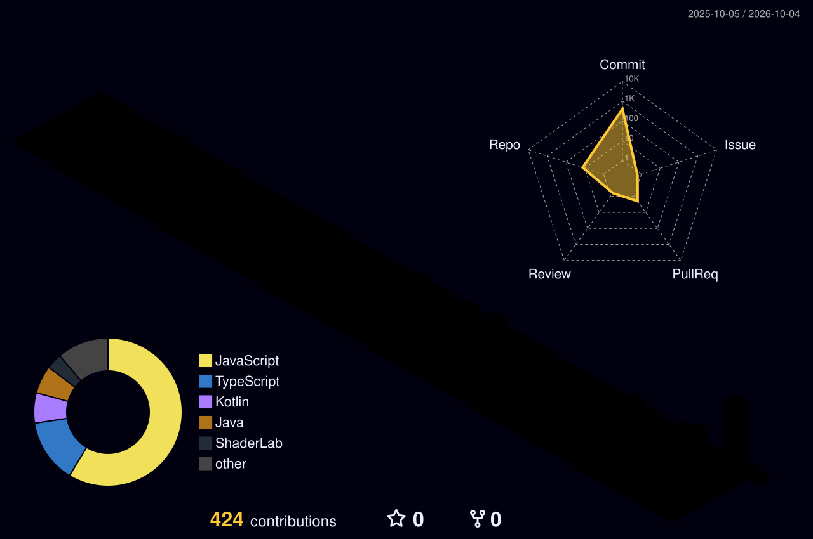

🎓 Estudiante de **Ingeniería de Sistemas/Software** · Universidad Autónoma de Bucaramanga (UNAB)

  

---

<table>
<tr>
<td width="32%" valign="top" align="center">

  

<kbd>📍 Bucaramanga, Colombia</kbd>
  
<kbd>🎓 Ing. Sistemas/Software</kbd>
  
<kbd>🏫 UNAB</kbd>
  
<kbd>🏗️ Software Architecture</kbd>

</td>
<td width="68%" valign="top">

### 🧠 Sobre mí

Estudio Ingeniería de Sistemas/Software en la UNAB, una carrera que abarca tanto el desarrollo de software como los fundamentos de sistemas: bases de datos, arquitectura, ingeniería de software, entre otros.

Soy un desarrollador en formación apasionado por construir software, pero con una visión que va más allá del código. Me interesa no solo programar, sino:

* 🏗️ Diseñar arquitecturas de software sólidas
* 🤖 Integrar inteligencia artificial (LLMs) en aplicaciones reales
* 🧩 Entender cómo se construyen sistemas grandes y escalables
* 🎯 Tomar decisiones técnicas con criterio

Disfruto el proceso de convertir ideas en soluciones funcionales, desde la lógica hasta la estructura completa del sistema.

### 🎯 Objetivo profesional

Convertirme en un **Software Architect / Tech Leader**, capaz de diseñar sistemas robustos, liderar productos tecnológicos, integrar IA generativa y orquestar equipos, tecnologías y procesos.

### 🔭 Actualmente estoy...

* 🧪 Integrando **LLMs** en aplicaciones reales con técnicas de *Prompt Engineering*
* 🏗️ Aplicando **Arquitectura Modular** y *Clean Code* en mis proyectos
* 📚 Estudiando patrones de diseño para sistemas distribuidos
* 💬 Abierto a charlar sobre: Django, IA aplicada, arquitectura de software

</td>
</tr>
</table>

---

## 🚀 Proyectos destacados

<table>
<tr>
<td width="50%" valign="top">

**🗺️ [Atlas Mágico](https://github.com/darman-prog/atlas-magico)**
Juego educativo para aprender sobre la cultura de distintos países, con preguntas de selección múltiple y mecánicas de gamificación.

</td>
<td width="50%" valign="top">

**🥘 [EcoReceta](https://github.com/darman-prog/EcoReceta)**
App para armar recetas de cocina usando productos disponibles en tiendas colombianas.

</td>
</tr>
<tr>
<td width="50%" valign="top">

**⚙️ [HarnessConfig](https://github.com/darman-prog/HarnessConfig)**
Configuración personal del harness con el que trabajo junto a agentes de IA en mi flujo de desarrollo.

</td>
<td width="50%" valign="top">

**📋 [Scrumter — Landing Page](https://github.com/darman-prog/scrumter_landing_page)**
Landing page de Scrumter.io, mi herramienta de gestión de proyectos con metodología Scrum.

</td>
</tr>
</table>

---

## ⚙️ Stack técnico

### 🧬 Lenguajes

  
  
  
  
  
  

### 🌐 Frameworks / Web

  
  
  
  
  
  
  

### 📱 Móvil y otros entornos

  
  
  

### 🗄️ Bases de datos

  
  
  
  

### 🏗️ Arquitectura y prácticas

  
  
  
  
  

### 🛠️ Herramientas y DevOps

  
  
  
  
  

---

## 🤖 IA & Agentes

  
  
  
  
  

## 📡 Mi Tech Radar Personal

| Tecnología | Estado | Justificación |
|:-----------|:-------|:--------------|
| Django + DRF | ✅ Adopt | Base sólida de mis proyectos backend |
| Arquitectura Modular | ✅ Adopt | Independencia de frameworks y testabilidad |
| FastAPI | 🧪 Trial | Microservicios de alto rendimiento con IA |
| Docker | 🧪 Trial | Containerización de mis aplicaciones |
| Kubernetes | 📋 Assess | Próximo paso para escalar sistemas |

> 💡 *Adopt = lo uso a diario · Trial = lo estoy probando · Assess = lo estoy investigando*

---

## 📊 Actividad en GitHub

<table>
<tr>
<td width="100%">

</td>
</tr>
</table>

<table>
<tr>
<td width="50%" valign="top">

</td>
<td width="50%" valign="top">

</td>
</tr>
</table>

### 🌐 Gráfica 3D de contribuciones

  

### 🐍 Snake de contribuciones

  

---

## 📫 Contacto

📧 Email: [damezago24@gmail.com](mailto:damezago24@gmail.com)  
🌐 [Instagram](https://instagram.com/dameza24) · [LinkedIn](https://www.linkedin.com/in/diego-andres-meza-rodriguez-b50078302/)

---

### 🚀 ¿Te interesa colaborar?

Estoy abierto a oportunidades de **prácticas, proyectos open-source y colaboraciones técnicas**.  
Si trabajas en arquitectura de software, IA aplicada o desarrollo de productos, ¡hablemos!

[📩 Escríbeme un email](mailto:damezago24@gmail.com) · [💼 Conecta en LinkedIn](https://www.linkedin.com/in/diego-andres-meza-rodriguez-b50078302/)

